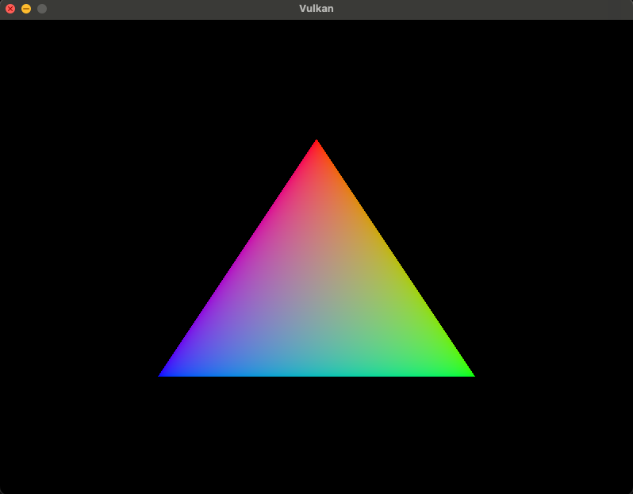

# Vulkan Engine

Vulkan rendering engine I am currently working on.

## Description

In-progress

Currently displaying just a triangle:

## Getting Started

### Dependencies

Currently developed and tested on MacOS Sonoma 14.5 (23F79) with Apple M1 Max chipset

- VulkanSDK 1.3.231.1
- GLFW 3.3
- CMake 3.10

### Installing

- TODO: CMake setup instructions?

### Executing program

- TODO: Just build and run?

## Help

TODO: Have to test with other environments

## Authors

Aleksander Dudek

## Version History

- Initial Release

## License

TODO

## Acknowledgments

Inspiration, code snippets, etc.

- [vulkan-tutorial](https://vulkan-tutorial.com/)
